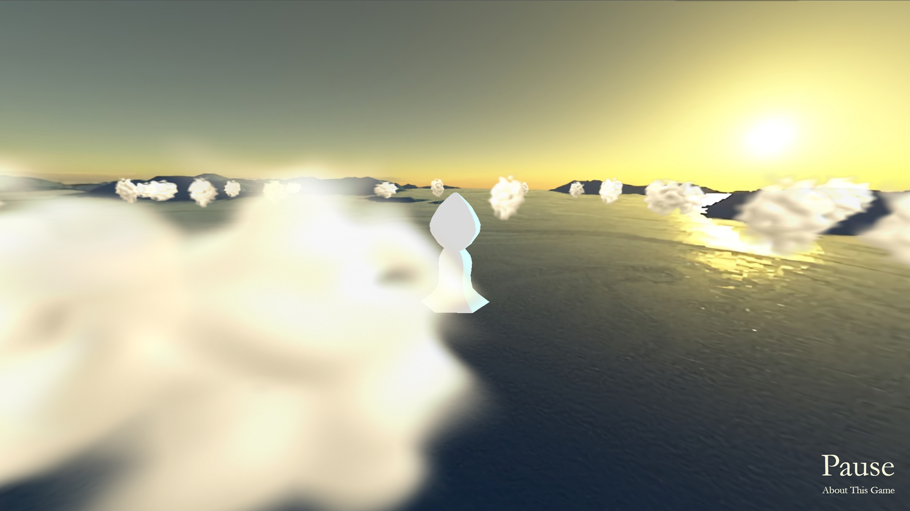

# "Cloud" Parody Project

## Prologue

To play the actual game, click [here](https://1st.moe/sites/cloud/). 
Note that this game is deployed on [my personal website](https://1st.moe/). 

If you don't care about the technical details but only want to test out the game for yourself, then there's pretty much no need to look at this repository. Just go ahead and enjoy! ヾ(•ω•`)o

## About This Game

This is a project to parody the once beloved video game "[Cloud](http://www.jenovachen.com/flowingames/cloud.htm)" by [ThatGameCompany](https://thatgamecompany.com/). 

It is also the product of the final project for the course [Advanced Course in Computer Graphics (2021)](https://www.wsl.waseda.jp/syllabus/JAA104.php?&pKey=5101GF1042012021510106107351&pLng=EN&pType=20181W18CF09), and a collaborated project between me and [@JyhWind](https://github.com/JyhWind). 

Developed within a ~1 month cycle, this game really wasn't all that easy since we were pretty much buried in deadlines, final projects, graduation researches, and etc. and thus could only squeeze out little chunks of time for the actual development process. 

Per the professor's wise words this should be called the "ちょこちょこ" development, but it was more like the "へとへと" development if I could say so myself. 

Nevertheless, I'm extremely glad that we made it in time. 

## Gameplay Demonstration

The actual gameplay looks something like this. 



As for the controls, etc., just follow the in-game tutorials and instructions. There should be enough explanations for you to start enjoying the game in seconds. 

But wait, there's more! 

Since you've already made it here, let me share with you a little secret - during gameplay, you can press on <kbd>g</kbd> to enable god mode, where you'll be able to start creating unlimited number of clouds out of thin air. (And press it again to disable the feature, of course)

Pretty cool, ain't it? 

## Technical Details 

I won't go into too much details here since you can literally read all the source code from this repository, but let me give you at least some explanations from a technical standpoint. 

### Basic Explanations 

To begin with, the actual gameplay is built around [Three.js](https://threejs.org/), a really cool JavaScript 3D library. 

Pretty much all the stuff, including the character movements, camera positioning, in-game interactions, are all based on and heavily modified from what Three.js has to offer. A HUGE thank you to these folks with the amazing libraries! 

As for the UI, I made them from scratch... And yes, they're all designed and typed in by hand, with effectively no copy-paste from external sources. 

All the animations (intermittently flashing words, etc.) are also done by careful calculations and manipulations of the property of objects (such as opacity, transparency, color, etc.). 

### In-Game Assets 

The main character model is taken from [Sketchfab](https://sketchfab.com/), and the original license is included within the `/model` folder. Author credit (which is required) could also be found within the same file, i.e., `/model/license.txt`, so please feel free to take a look. 

All the assets, including the character model, skybox, background, etc., are either under CC terms for free non-commercial usages or just plain free-to-use ones. The only exception is the one image within the "About This Game" page, where it's taken from the original "Cloud" game website. 

The clouds though - they're procedurally generated. I believe it's partially the reason why the game is so heavy - since ALL of them are being animated at the same time. 

## Epilogue

This concludes the explanations to what's going on in this repository, I guess. 

But before you go, one last thing to note... 

```
Plz don't steal our game!! 
I'm sure you won't. You're just the nicest, aren't you? (o゜▽゜)o☆
```

Enjoy!! ( •̀ ω •́ )y